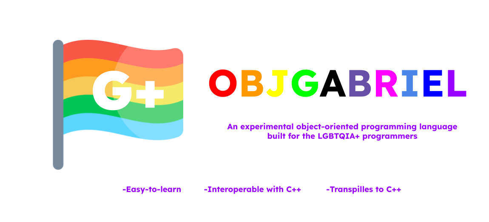

# ObjGabriel

Linguagem de programação sem sentido nem finalidade baseada em C criada por mim e pelo @Redwars22

# Como usar

> ```bash
> ./gabriel nome_do_arquivo.gabriel   
> ```

Exemplo de programa Hello World:

> ```c++
> import gabriel
>
> act main() -> bi32 {
>    Gabriel::print("Hello world!");
>    getout 0;
>}
> ```