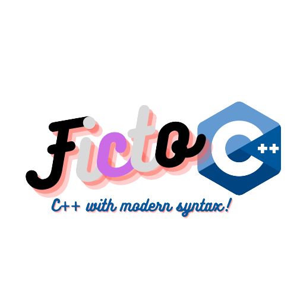
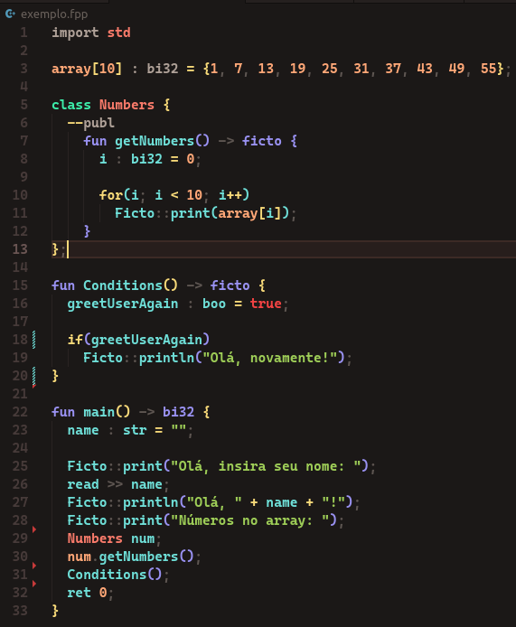

# FictoC++



O FictoC++ é fork do ObjGabriel, um projeto de linguagem de programação para ser sucessora do C++ criado pelo @Redwars22 e pelo @gabrielficto. Ele possui uma sintaxe mais moderna, seguindo as tendências de linguagens como Rust, Kotlin e TypeScript e ao mesmo tempo sendo familiar ao bom e velho C/C++. O código em FictoC++ é transpilado para C++ e em seguida compilado com o g++ para gerar executáveis Linux ou .exe que podem ser executados no Windows. Ele é interoperável com o C++, então você pode usar todas as suas bibliotecas e inclusive usar código C++ intercambiavelmente ao longo do código em FictoC++.



### SOBRE O PROJETO

- Descrição curta: Uma linguagem orientada a objetos interoperável com C++, derivada do ObjGabriel
- Categoria: Linguagens (inúteis) de programação
- Site oficial: [FictoC++](https://redwars22.github.io/andrewnation/fictocpp/)
- Status do projeto: Em beta

### DESENVOLVIMENTO

- Linguagem de programação: C++ e ObjGabriel
- Repositório: [https://github.com/Redwars22/fictocpp](https://github.com/Redwars22/fictocpp)

### LANÇAMENTOS

- Download (versão beta): [https://github.com/Redwars22/fictocpp/tags](https://github.com/Redwars22/fictocpp/tags)

# Como usar

No Linux, as instruções são as seguintes:

> ```bash
> ./ficto nome_do_arquivo.fpp
> ```

No Windows, só executar o `ficto.exe` pelo CMD e passar como argumento o arquivo ou o caminho até o arquivo `.fpp`. Também é necessário ter o compilador G++ instalado.

Só criar um arquivo com a extensão .fpp, ir até a pasta onde tá o executável do FictoC++, e digitar ./ficto no terminal seguido pelo caminho até o arquivo .fpp que você criou. Se tudo estiver ok, ele vai compilar para C++ usando o g++ e daí vai executar automaticamente o seu programa e gerar um executável dele.

Exemplo de programa Hello World:

> ```c++
> import std
>
> fun main() -> bi32 {
>    Ficto::print("Hello world!");
>    ret 0;
> }
> ```
