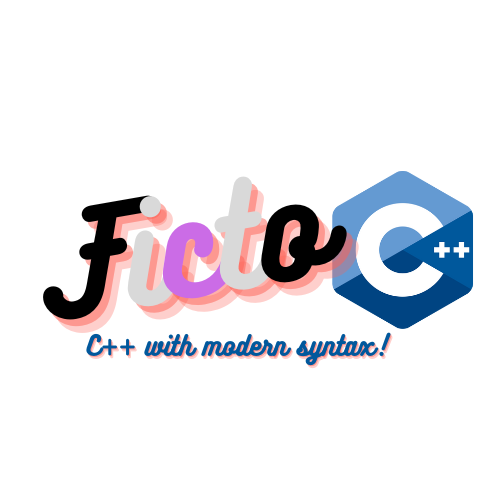

# FictoC++


Linguagem de programação sem sentido nem finalidade baseada em C criada por mim e pelo @Redwars22

O FictoC++ (futuramente será renomeado para LGBTScript) é uma linguagem de programação sem sentido nem finalidade baseada em C++ e orientada a objetos criada por mim e pelo meu amigo @Redwars22. Seu intuito é basicamente nenhum, só ter uma versão do C++ com termos LGBT no lugar das palavras-chaves "normais" pra eu e o meu amigo usarmos nos nossos programas que seriam feitos em C++. O código em LGBTScript é transpilado para C++ e em seguida compilado com o g++ para gerar executáveis Linux ou .exe que podem ser executados no Windows. Ele é interoperável com o C++, então você pode usar todas as suas bibliotecas e inclusive usar código C++ intercambiavelmente ao longo do código em LGBTScript.

### SOBRE O PROJETO

- Descrição curta: Uma linguagem orientada a objetos interoperável com C++, derivada do ObjGabriel
- Categoria: Linguagens (inúteis) de programação
- Site oficial: NÃO TEM PORRA!!!
- Status do projeto: Em beta

### DESENVOLVIMENTO

- Linguagem de programação: C++ e ObjGabriel
- Repositório:

### LANÇAMENTOS

- Download (versão beta):

[📚️ LER MANUAL DA LINGUAGEM]

# Como usar

No Linux, as instruções são as seguintes:

> ```bash
> ./ficto nome_do_arquivo.fpp
> ```

No Windows, só executar o `ficto.exe` pelo CMD e passar como argumento o arquivo ou o caminho até o arquivo `.fpp`. Também é necessário ter o compilador G++ instalado.

Só criar um arquivo com a extensão .fpp, ir até a pasta onde tá o executável do FictoC++, e digitar ./ficto no terminal seguido pelo caminho até o arquivo .fpp que você criou. Se tudo estiver ok, ele vai compilar para C++ usando o g++ e daí vai executar automaticamente o seu programa e gerar um executável dele.

Exemplo de programa Hello World:

> ```c++
> import std
>
> fun main() -> bi32 {
>    Ficto::print("Hello world!");
>    ret 0;
> }
> ```
